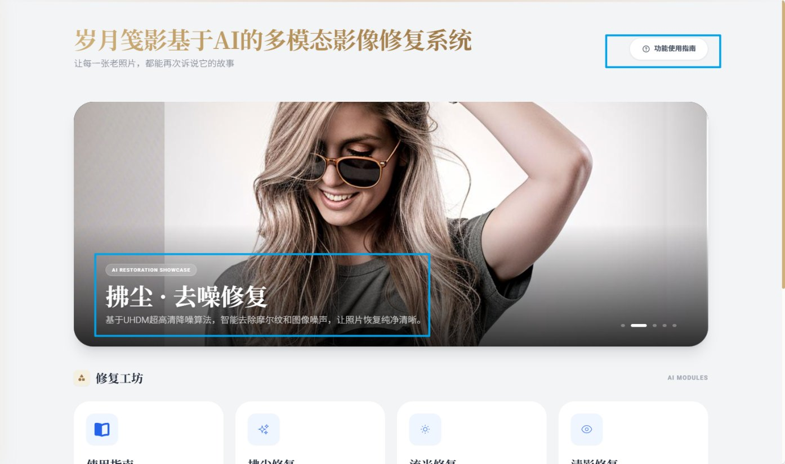
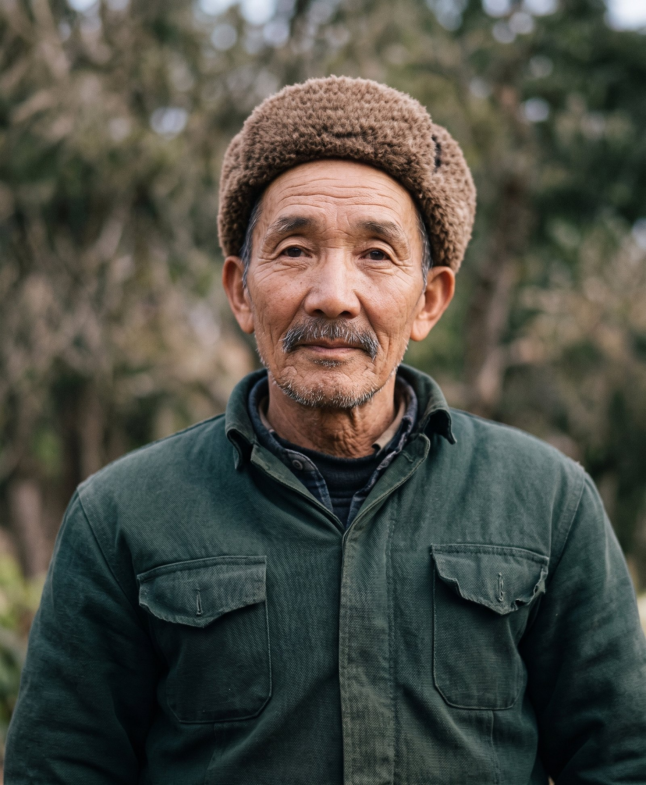
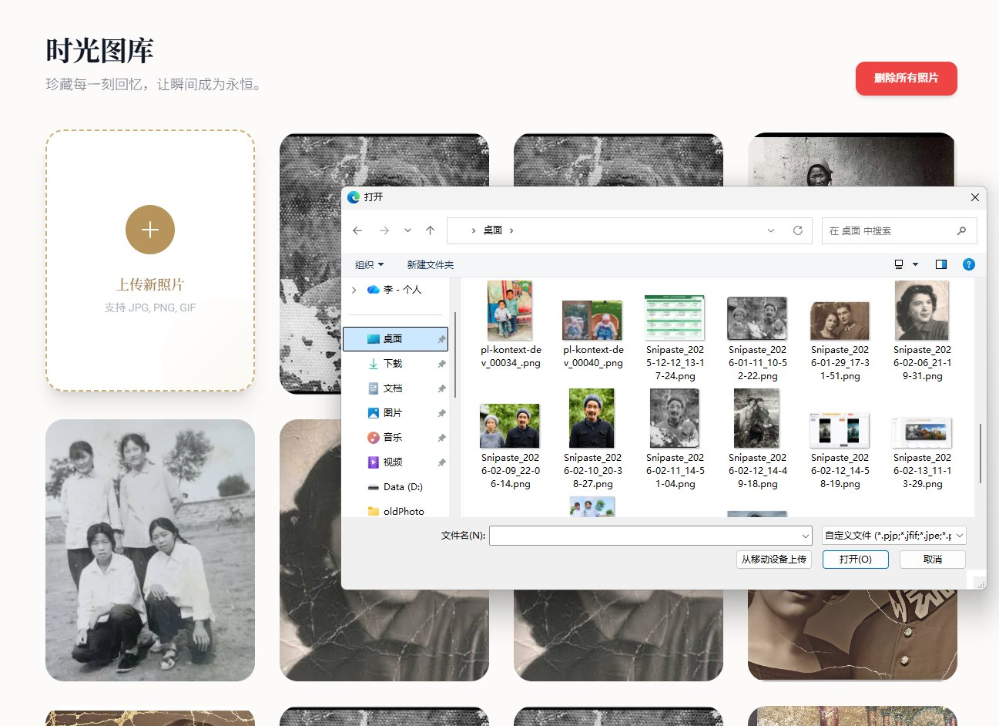
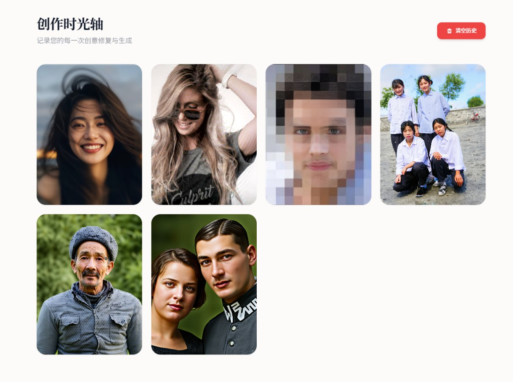
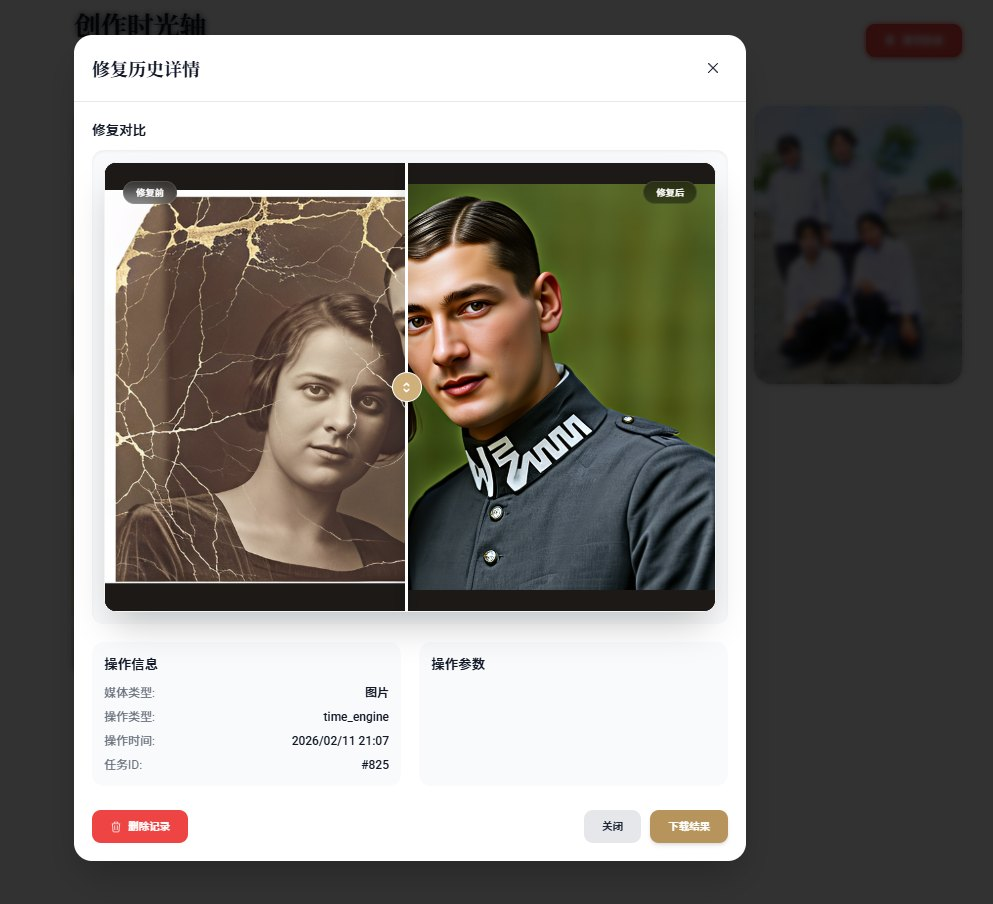
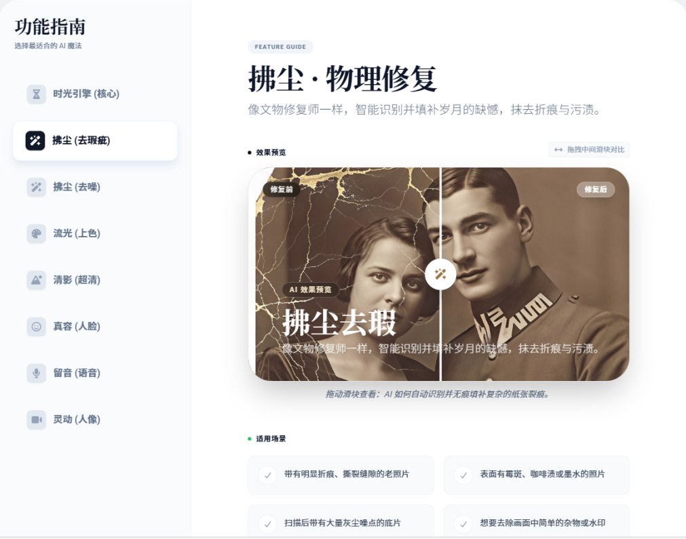
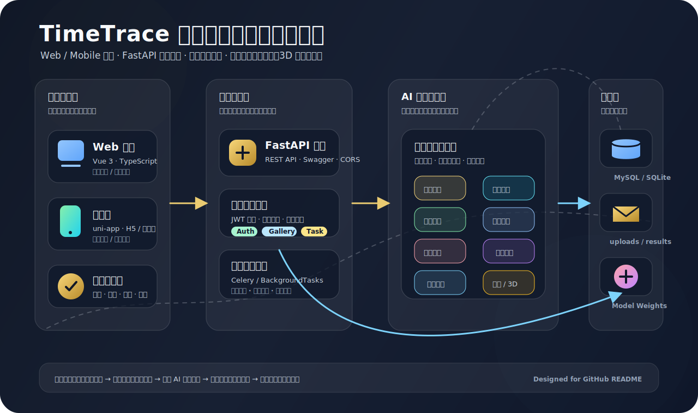
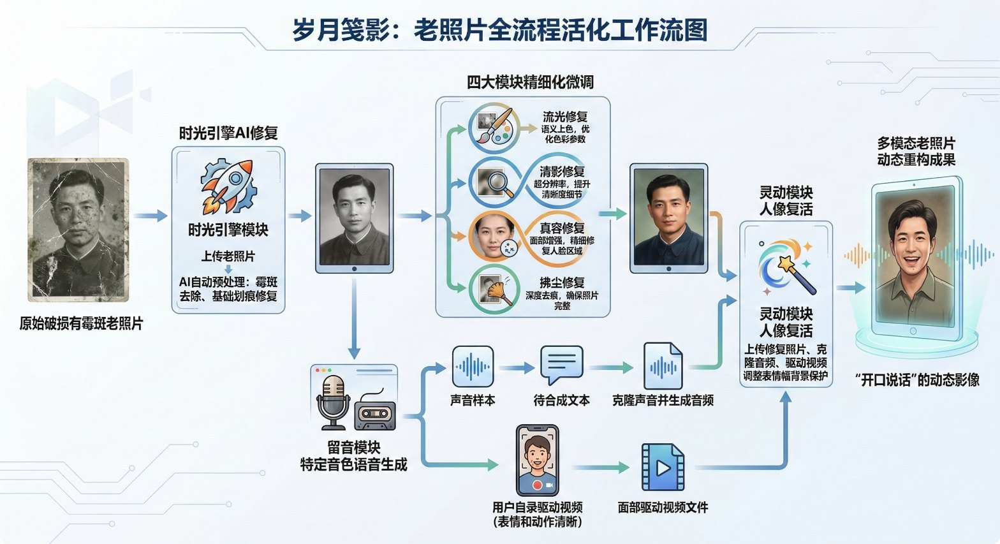

# 岁月笺影 TimeTrace

<p align="center">
  
</p>

<p align="center">
  <strong>面向各类影像的 AI 多模态修复、增强与数字记忆再生系统</strong>
</p>

<p align="center">
  
  
  
  
  
  
</p>

## 项目定位

岁月笺影（TimeTrace）是一套围绕影像修复、画质增强与数字内容再生构建的全栈 AI 应用。项目并不局限于老照片，也适用于家庭影像、历史资料、低清扫描件、受损图片、普通人像、现代瑕疵照片、教学素材和创意内容处理。

系统将图像修复、黑白上色、超清重建、人脸增强、局部重绘、语音克隆、人像动态化和 2D 转 3D 等能力整合到统一工作流中，让用户可以从“上传一张影像”开始，完成从静态修复到动态重建的完整创作链路。

项目包含三端工程：

| 工程 | 技术栈 | 说明 |
| --- | --- | --- |
| `TimeTrace_frontend` | Vue 3、TypeScript、Vite、Tailwind CSS | Web 端创作工坊、图库、历史记录、参数面板 |
| `TimeTrace_Mobile` | uni-app、Vue、TypeScript | 移动端 / H5 / 小程序端，覆盖随拍上传与移动查看场景 |
| `TimeTrace_Backend` | FastAPI、SQLAlchemy、Celery、Redis、PyTorch | 后端 API、任务调度、AI 模块封装、结果持久化 |

## 解决的问题

传统影像修复工具常见的问题是能力分散、操作复杂、语义理解弱、模型部署成本高。TimeTrace 针对这些痛点做了系统化整合：

| 痛点 | TimeTrace 的解决方式 |
| --- | --- |
| 修复链路割裂 | 将上传、处理、参数控制、进度追踪、结果预览、下载与历史记录串成完整闭环 |
| 模态单一 | 从图片修复扩展到语音、人像视频与 3D 重建，支持多模态内容再生 |
| 提示词门槛高 | 封装模块化参数面板与预设工作流，降低普通用户使用生成式 AI 的难度 |
| 推理成本高 | 接入量化模型、按需加载与异步调度，减轻本地 GPU 与服务端压力 |
| 结果不可追溯 | 通过任务表、历史表、图库与结果路径记录完整处理过程 |

## 适用场景

- 普通家庭：修复老照片、家庭合影、纪念照，重塑家族影像记忆。
- 文博与方志机构：对历史影像、扫描档案、残损资料进行数字化保护。
- 内容创作者：增强低清素材、处理瑕疵图片、生成动态人像与叙事短片。
- 教学与展示：让历史人物、课本插图、纪念资料获得更生动的数字化表达。
- 普通影像处理：处理现代照片中的模糊、噪点、压缩损伤、划痕和低分辨率问题。

## 效果展示

| 拂尘修复 | 去噪修复 |
| --- | --- |
|  |  |

| 流光上色 | 清影超清 |
| --- | --- |
|  |  |

| 真容修复 | 时光引擎 |
| --- | --- |
|  |  |

## 产品界面

| 图库管理 | 历史记录 |
| --- | --- |
|  |  |

| 修复预览 | 移动端页面 |
| --- | --- |
|  |  |

## 技术架构

<p align="center">
  
</p>

TimeTrace 采用“多端入口 + 统一 API 网关 + 异步任务调度 + 多模态 AI 引擎 + 数据持久化”的分层架构。前端负责交互与参数组织，后端负责认证、图库、任务和接口编排，AI 模块层负责修复、上色、超清、人脸、语音、人像动态化和 3D 生成，数据层负责用户、素材、任务、历史与结果文件的持久化。

<p align="center">
  
</p>

## 核心能力

| 模块 | 能力说明 | 典型场景 |
| --- | --- | --- |
| 时光引擎 | 基于 Flux / ComfyUI 工作流的全图智能重绘与语义级重构 | 严重老化、整体质感重塑、创意修复 |
| 拂尘修复 | 去除划痕、折痕、灰尘、污渍，支持自动识别与手动涂抹 | 老照片破损修复、局部瑕疵清理 |
| 去噪修复 | 面向噪点、摩尔纹、低质扫描图的图像净化 | 扫描件增强、低清照片净化 |
| 流光上色 | 黑白照片智能上色与色彩增强 | 历史黑白照片、旧影像彩色化 |
| 清影修复 | 清晰度提升、细节重建、画质增强 | 模糊照片、低分辨率照片 |
| 真容修复 | 人脸区域精修、五官细节增强、肖像真实感提升 | 家庭合影、人像旧照、证件类素材 |
| 留音 | 文本转语音与声音克隆能力封装 | 影像旁白、纪念短片、叙事内容 |
| 灵动人像 | 音频或视频驱动的人像动态复活 | 让照片中的人物自然开口说话 |
| 维度重塑 | 2D 照片生成可交互 3D 模型 | 纪念物、人物、物件立体化展示 |

## 模块详解

### 时光引擎：全图智能重绘

时光引擎是项目的核心重构模块，面向严重退化、信息缺失或整体质感不足的影像。它不是简单的像素修补，而是通过生成式模型对影像内容、年代背景、人物结构和画面语义进行综合理解，在潜空间中完成更高层次的重建。

该模块适合处理大面积老化、低清、失焦、材质缺失以及需要整体画面风格重塑的场景。为了降低使用门槛，前端将复杂模型参数封装为更直观的控制项，用户可以在不理解底层节点的情况下完成高质量修复。

### 拂尘修复：物理损伤净化

拂尘修复面向划痕、折痕、霉斑、污渍、水印和局部破损等“硬伤”。系统提供自动修复、手动涂抹和局部精修能力：自动模式适合快速清理明显损伤，手动模式适合精确标记顽固瑕疵，局部重绘则用于更复杂的内容补全。

### 声影同频：从静态影像到动态表达

声影同频模块将语音合成、声音克隆与人像动画工作流结合起来，让一张静态人物照片能够生成具有口型同步和表情变化的动态视频。该能力使项目从“照片修复工具”扩展为“数字记忆再生平台”，适合纪念短片、历史人物讲述、家庭影像叙事等场景。

### 多端创作体验

Web 端更适合桌面创作、参数调试和结果管理；移动端覆盖快速上传、移动预览和轻量使用场景。两端通过统一后端 API 接入同一套任务系统，保证用户资产、处理结果和历史记录的一致性。

## 数据设计

系统围绕“用户上传 → AI 任务调度 → 结果生成 → 历史追溯”的业务链路设计数据表，核心实体包括：

| 数据表 | 作用 |
| --- | --- |
| `users` | 存储用户基础信息、认证信息与权限关联 |
| `photos` | 记录用户上传的原始影像、文件路径、上传时间与素材状态 |
| `masks` | 存储局部修复中使用的手动或自动蒙版 |
| `tasks` | 记录任务类型、执行步骤、参数 JSON、状态、进度与结果路径 |
| `histories` | 记录用户操作历史、修复类型、结果媒体与时间线信息 |

这种设计保证了多模型推理任务在失败、重试、轮询、历史回看和结果下载时都有可追溯的数据依据。

## 工程亮点

- 多端完整闭环：Web 端、移动端和后端服务同时具备，覆盖创作、预览、管理和移动使用。
- 多模态扩展：从图片修复延伸到语音、人像视频和 3D 重建，不只是单一滤镜工具。
- 模块化 AI 工坊：每个能力拥有独立参数面板和任务流程，可单独使用，也可串联继续修复。
- 异步任务调度：后端封装多种 AI 模块，支持状态追踪、进度轮询、失败处理与结果持久化。
- 低门槛交互：把复杂的模型工作流封装成普通用户能理解的上传、选择、处理和保存流程。
- 可扩展架构：AI 模块、业务服务、数据存储和前端交互分层清晰，后续可继续接入新模型。

## 技术栈

| 层级 | 技术 |
| --- | --- |
| Web 前端 | Vue 3、TypeScript、Vite、Tailwind CSS、Axios |
| 移动端 | uni-app、Vue、TypeScript、H5 / 小程序构建 |
| 后端 API | FastAPI、Pydantic、SQLAlchemy、JWT |
| 任务调度 | Celery、Redis、BackgroundTasks |
| 数据存储 | MySQL / SQLite、uploads / results 文件存储 |
| AI 推理 | PyTorch、ComfyUI、Flux、LaMa、DDColor、GFPGAN / CodeFormer、GPT-SoVITS、LivePortrait 等 |
| 工程能力 | 模块化路由、统一 API 封装、进度轮询、历史记录、模型权重外置 |

## 快速开始

### 1. 后端

```bash
cd TimeTrace_Backend
python -m venv .venv
.venv\Scripts\activate
pip install -r requirements.txt
python run_server.py
```

默认服务地址：

- API: `http://localhost:8000`
- Swagger: `http://localhost:8000/docs`
- Redoc: `http://localhost:8000/redoc`

### 2. Web 前端

```bash
cd TimeTrace_frontend
npm install
npm run dev
```

### 3. 移动端

```bash
cd TimeTrace_Mobile
npm install
npm run dev:h5
```

如需运行小程序端，请使用对应的 uni-app 构建命令，例如 `npm run dev:mp-weixin`。

## 环境变量

建议从 `.env.example` 创建本地 `.env`，不要提交真实密钥。

```env
DB_USER=root
DB_PASSWORD=your_password
DB_HOST=localhost
DB_PORT=3306
DB_NAME=timetracedb
REDIS_HOST=localhost
REDIS_PORT=6379
TRIPO_API_KEY=your_tripo_api_key
```

## 模型与大文件说明

本仓库不建议上传模型权重、训练数据、第三方预训练目录、运行输出文件和私人测试素材。请查看 [MODEL_WEIGHTS.md](MODEL_WEIGHTS.md) 获取模型放置路径和下载说明。

推荐保留在 GitHub 的内容：

- 项目源码
- 配置模板
- 工作流 JSON
- README / 使用说明 / 致谢文档
- 少量精选 demo 对比图与界面截图

不推荐上传的内容：

- `*.pth`, `*.pt`, `*.ckpt`, `*.safetensors`, `*.bin`, `*.onnx`, `*.gguf`
- `static/uploads/`, `static/results/`
- `.env`, 数据库文件、日志文件
- `node_modules/`, Python 虚拟环境、第三方缓存目录

如果模型文件已经进入 Git 历史，仅修改 `.gitignore` 还不够，建议使用 `git filter-repo` 或 BFG Repo-Cleaner 清理历史后再推送 GitHub。

## 开源项目与二次开发声明

岁月笺影是一个二次创作与工程整合项目。项目将多个优秀开源算法、模型推理工程与自研的前后端产品体验、任务调度、模块化参数系统、图库 / 历史记录系统进行整合，形成一套完整可运行的 AI 影像修复应用。

详细第三方项目、许可证与致谢请查看 [THIRD_PARTY_NOTICES.md](THIRD_PARTY_NOTICES.md)。在正式开源、参赛、商用或部署前，请逐项确认上游项目许可证、模型许可证和数据使用条款。

## 项目结构

```text
oldPhotoRstoration_new/
├─ TimeTrace_Backend/      # FastAPI 后端与 AI 模块调度
├─ TimeTrace_frontend/     # Vue 3 Web 前端
├─ TimeTrace_Mobile/       # uni-app 移动端
├─ docs/                   # README 图示与架构图
├─ MODEL_WEIGHTS.md        # 模型权重说明
├─ THIRD_PARTY_NOTICES.md  # 第三方项目致谢与许可证说明
└─ README.md
```

## 后续规划

- 优化推理效率：继续引入轻量化模型、量化权重与按需加载策略，降低硬件门槛。
- 扩展批量处理：面向家庭相册、文博档案和机构资料增加批量修复能力。
- 完善版本回溯：为同一张影像保留多次修复版本，支持对比、回滚和再创作。
- 增强模型管理：补充模型下载、校验、路径配置和自动检测能力。
- 完善部署文档：补充 Docker、GPU 环境、Redis / MySQL 初始化和生产部署说明。

## Star 支持

如果这个项目对你理解 AI 影像修复、多模态创作工作流或前后端 AI 应用集成有帮助，欢迎点一个 Star。你的支持会让我继续完善模型接入、部署文档和更多修复效果展示。

## 推荐 GitHub Topics

`old-photo-restoration`, `ai-restoration`, `image-restoration`, `vue3`, `fastapi`, `uni-app`, `comfyui`, `flux`, `colorization`, `liveportrait`, `voice-cloning`, `multimodal-ai`
