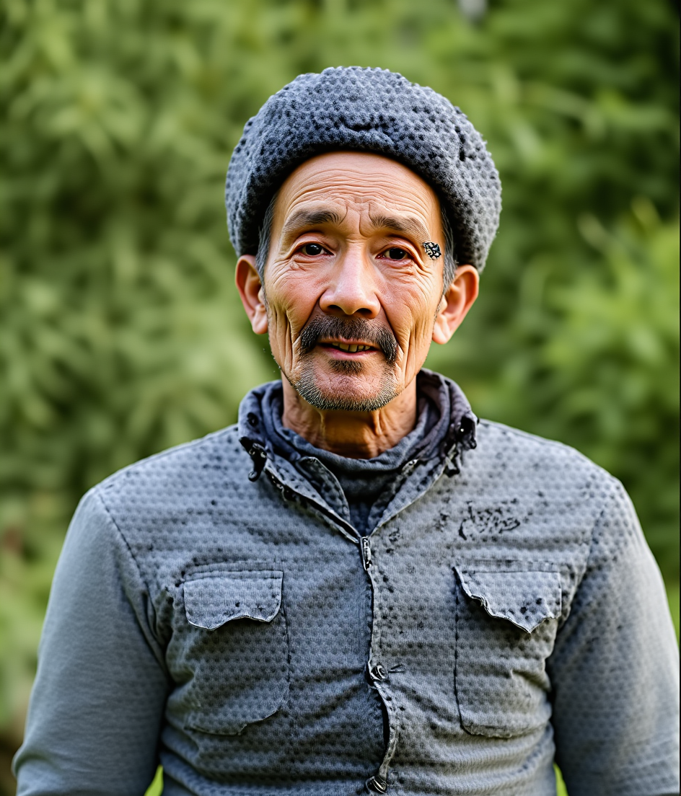
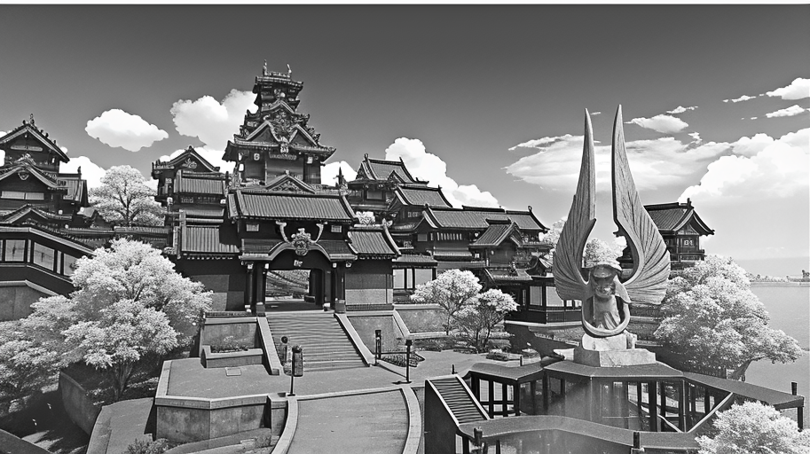
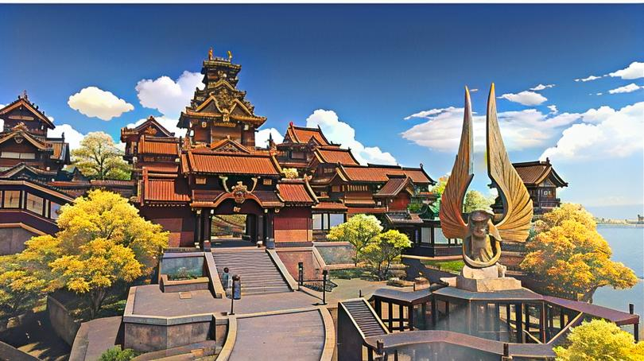
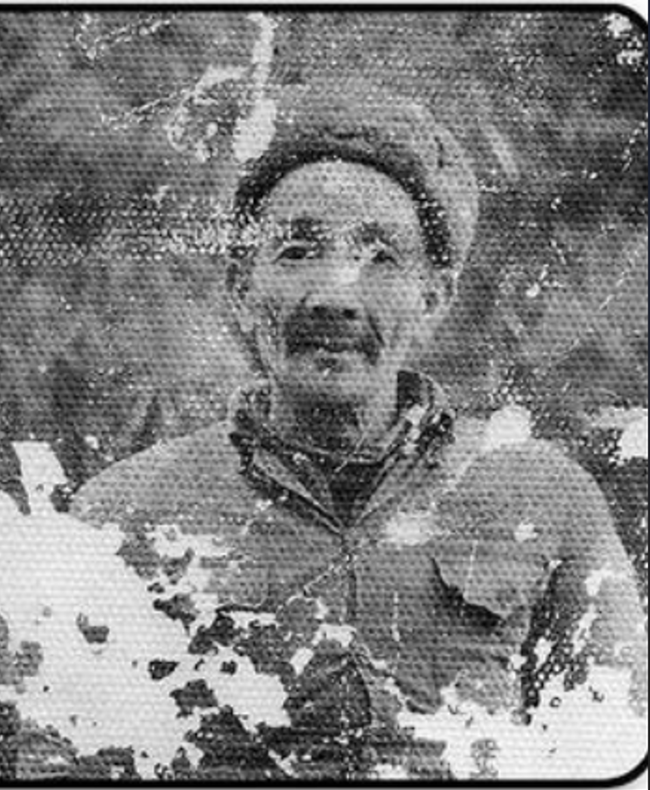
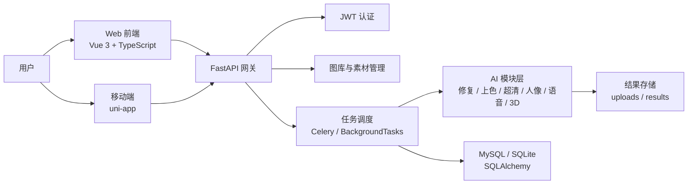

# 岁月笺影 TimeTrace

<p align="center">
  
</p>

<p align="center">
  <strong>基于 AI 的多模态影像修复系统，让老照片重新变清晰、变鲜活、变可讲述。</strong>
</p>

<p align="center">
  
  
  
  
  
  
</p>

## 项目简介

岁月笺影（TimeTrace）是一套面向老照片、家庭影像、历史资料与创意内容的 AI 多模态修复平台。项目不仅提供传统意义上的老照片去痕、上色、超清重构和人脸增强，还进一步扩展到语音合成/声音克隆、人像动态复活、2D 照片转 3D 模型等能力，形成从“静态修复”到“动态重建”的完整创作链路。

项目包含三端工程：

- `TimeTrace_frontend`: Vue 3 + TypeScript Web 前端
- `TimeTrace_Mobile`: uni-app 移动端/小程序端
- `TimeTrace_Backend`: FastAPI 后端与 AI 模块调度层

## 效果展示

| 拂尘修复 | 去噪修复 |
| --- | --- |
|  |  |

| 流光上色 | 清影超清 |
| --- | --- |
|  |  |

| 真容修复 | 时光引擎 |
| --- | --- |
|  |  |

## 核心功能

| 模块 | 能力说明 | 典型场景 |
| --- | --- | --- |
| 时光引擎 | 基于 Flux/ComfyUI 工作流的一键式全图智能重绘 | 严重老化、整体质感重塑、创意修复 |
| 拂尘修复 | 去除划痕、折痕、灰尘、污渍，支持自动识别与手动涂抹 | 老照片破损修复、局部瑕疵清理 |
| 去噪修复 | 面向噪点、摩尔纹、低质扫描图的图像净化 | 扫描件增强、低清照片净化 |
| 流光上色 | 黑白照片智能上色与色彩增强 | 历史黑白照片上色 |
| 清影修复 | 清晰度提升、细节重建、画质增强 | 模糊照片、低分辨率照片 |
| 真容修复 | 人脸区域精修、五官细节增强、肖像真实感提升 | 家庭合影、人物老照片 |
| 留音 | 文本转语音与声音克隆能力封装 | 影像叙事、纪念短片旁白 |
| 灵动人像 | 音频/视频驱动的人像动态复活 | 让照片中的人物开口说话 |
| 维度重塑 | 2D 照片生成可交互 3D 模型 | 纪念物、人物/物件立体化展示 |

## 技术架构



## 工程亮点

- 多端体验完整：Web 端负责桌面创作，uni-app 移动端覆盖移动使用场景。
- 模块化 AI 工坊：每个修复能力独立参数面板、独立任务流程，可单独使用也可继续修复。
- 前后端完整闭环：登录注册、图库管理、任务创建、进度轮询、历史记录、结果预览与下载。
- 真实工程调度：后端统一封装多种 AI 模块，支持异步任务、状态追踪、结果持久化。
- 视觉体验完整：项目内置前后对比组件、扫描式轮播展示、情绪化加载文案和白金视觉风格。
- 多模态扩展：从图片修复扩展到声音、人像视频、3D 重建，不只是单一滤镜工具。

## 模型与大文件说明

本仓库不建议上传模型权重、训练数据、第三方预训练目录、运行输出文件和私人测试素材。请查看 [MODEL_WEIGHTS.md](MODEL_WEIGHTS.md) 获取模型放置路径和下载说明。

推荐保留在 GitHub 的内容：

- 项目源码
- 配置模板
- 工作流 JSON
- README / 使用说明 / 致谢文档
- 少量精选 demo 对比图

不推荐上传的内容：

- `*.pth`, `*.pt`, `*.ckpt`, `*.safetensors`, `*.bin`, `*.onnx`, `*.gguf`
- `static/uploads/`, `static/results/`
- `.env`, 数据库文件、日志文件
- `node_modules/`, Python 虚拟环境、第三方缓存目录

## 开源项目与二次开发声明

岁月笺影是一个二次创作与工程整合项目。项目将多个优秀开源算法、模型推理工程与自研的前后端产品体验、任务调度、模块化参数系统、图库/历史记录系统进行整合，形成一套完整可运行的 AI 影像修复应用。

详细第三方项目、许可证与致谢请查看 [THIRD_PARTY_NOTICES.md](THIRD_PARTY_NOTICES.md)。在正式开源、参赛、商用或部署前，请逐项确认上游项目许可证、模型许可证和数据使用条款。

## 快速开始

### 1. 后端

```bash
cd TimeTrace_Backend
python -m venv .venv
.venv\Scripts\activate
pip install -r requirements.txt
python run_server.py
```

默认服务地址：

- API: `http://localhost:8000`
- Swagger: `http://localhost:8000/docs`
- Redoc: `http://localhost:8000/redoc`

### 2. Web 前端

```bash
cd TimeTrace_frontend
npm install
npm run dev
```

### 3. 移动端

```bash
cd TimeTrace_Mobile
npm install
npm run dev:h5
```

如需运行小程序端，请使用对应的 uni-app 构建命令，例如 `npm run dev:mp-weixin`。

## 环境变量

建议从 `.env.example` 创建本地 `.env`，不要提交真实密钥。

```env
DB_USER=root
DB_PASSWORD=your_password
DB_HOST=localhost
DB_PORT=3306
DB_NAME=timetracedb
REDIS_HOST=localhost
REDIS_PORT=6379
TRIPO_API_KEY=your_tripo_api_key
```

## GitHub 上传建议

如果你已经把模型、运行结果或测试素材提交进 Git 历史，仅修改 `.gitignore` 还不够。需要先从索引中移除这些文件，再重新提交：

```bash
git rm -r --cached TimeTrace_Backend/static/uploads TimeTrace_Backend/static/results
git rm -r --cached TimeTrace_Backend/app/timetrace.db TimeTrace_Backend/app.log
git add .
git commit -m "docs: prepare project for GitHub release"
```

如果模型文件已经进入历史记录并且体积很大，建议使用 `git filter-repo` 或 BFG Repo-Cleaner 清理历史后再推 GitHub。

## 项目结构

```text
oldPhotoRstoration_new/
├─ TimeTrace_Backend/      # FastAPI 后端与 AI 模块调度
├─ TimeTrace_frontend/     # Vue 3 Web 前端
├─ TimeTrace_Mobile/       # uni-app 移动端
├─ MODEL_WEIGHTS.md        # 模型权重说明
├─ THIRD_PARTY_NOTICES.md  # 第三方项目致谢与许可证说明
└─ README.md
```

## Star 支持

如果这个项目对你理解 AI 老照片修复、多模态创作工作流或前后端 AI 应用集成有帮助，欢迎点一个 Star。你的支持会让我继续完善模型接入、部署文档和更多修复效果展示。

## 推荐 GitHub Topics

`old-photo-restoration`, `ai-restoration`, `image-restoration`, `vue3`, `fastapi`, `uni-app`, `comfyui`, `flux`, `colorization`, `liveportrait`, `voice-cloning`, `multimodal-ai`
